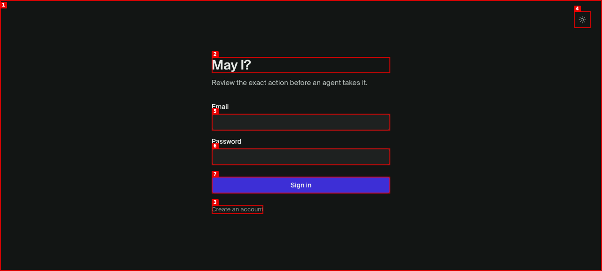
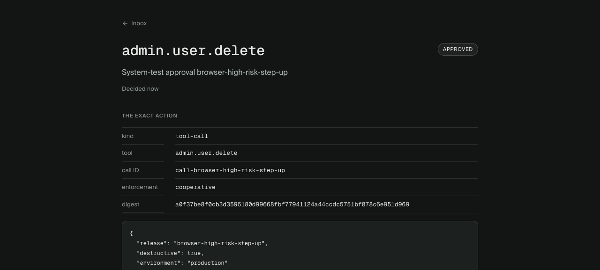

# Dogfood Report: May I? PR #36

| Field | Value |
|-------|-------|
| **Date** | 2026-07-16 |
| **App URL** | http://localhost:3300/ |
| **Session** | mayi-pr36-e2e |
| **Scope** | Full approval system, TypeScript consumers, and browser approval/denial workflows |

## Summary

| Severity | Count |
|----------|-------|
| Critical | 3 |
| High | 11 |
| Medium | 10 |
| Low | 2 |
| **Total** | **26** |

## Issues

### ISSUE-001: Production-built local app crashes before rendering

| Field | Value |
|-------|-------|
| **Severity** | critical |
| **Category** | functional / console |
| **URL** | http://localhost:3300/ |
| **Repro Video** | N/A (visible on load) |

**Description**

The documented local production-like server serves the web application over loopback HTTP. The application constructs `MayiClient` with the insecure-loopback option enabled only when `import.meta.env.DEV` is true, so a production bundle throws `MayiConfigurationError` during module initialization and renders an empty page. The console records the uncaught configuration error before React mounts.

**Repro Steps**

1. Build the workspace and serve the Nitro application on a loopback HTTP origin.
2. Navigate to `http://localhost:3300/`.
3. **Observe:** the page is blank and has no interactive accessibility nodes; the console contains `MayiConfigurationError: The Mayi client configuration is invalid`.

   

**Resolution:** fixed and verified in the rebuilt production bundle.

### ISSUE-002: Dynamic registration fails through the documented development server

| Field | Value |
|-------|-------|
| **Severity** | medium |
| **Category** | functional / development |
| **URL** | http://127.0.0.1:3301/api/oauth/register |
| **Repro Video** | N/A (HTTP API) |

**Description**

Nitro's development proxy hides its internal socket address from H3. The registration endpoint therefore rejected every client with `400 Registration source IP is unavailable`, even though the production Node server worked. The fallback must use Nitro's single-address forwarded identity only in a development build; production must continue ignoring caller-supplied forwarding headers.

**Resolution:** fixed and verified against a live `pnpm dev` server. Unit coverage proves production ignores the same header and development rejects forwarded chains.

### ISSUE-003: A late idempotent replay becomes invalid for the TypeScript SDK

| Field | Value |
|-------|-------|
| **Severity** | high |
| **Category** | functional / data integrity |
| **URL** | /api/approvals/request |
| **Repro Video** | N/A (TypeScript consumer) |

**Description**

The server stored only the approval ID for an idempotent request, then reconstructed the response from current state. If the original `PENDING` approval became approved, denied, cancelled, or expired before a lost-response retry, the replay returned that terminal state. `@mayi/sdk` correctly requires `approvals.request()` to resolve to a sealed pending approval and rejected the response as invalid.

**Resolution:** the server now persists and replays the complete immutable original response inside the creation transaction. A live consumer passed ten concurrent replays after the database approval was transitioned to `DENIED`; a changed payload under the same key still returns 409.

### ISSUE-004: Browser high-risk step-up never prompts

| Field | Value |
|-------|-------|
| **Severity** | high |
| **Category** | functional / authentication |
| **URL** | http://127.0.0.1:3300/?approval=jJqPhUECjarC |
| **Repro Video** | N/A |

**Description**

The web UI looked for the server phrase `Recent authentication` in an SDK error message. The SDK deliberately replaces HTTP bodies with the generic message `The Mayi service rejected the request`, so a high-risk decision stopped at 403 and never offered step-up authentication.

**Resolution:** the SDK now exposes only an allowlisted `step_up_required` machine code while continuing to suppress the rest of the response body. The browser re-authenticated, approved the high-risk action, rendered the receipt, and the consumer verified its callback and exact receipt.

### ISSUE-005: Refresh-token reuse detection rolls back revocation

| Field | Value |
|-------|-------|
| **Severity** | critical |
| **Category** | security / authentication |
| **URL** | /api/oauth/token |
| **Repro Video** | N/A (OAuth token API) |

**Description**

Refresh-token reuse was detected and returned 400, but the handler threw from inside the transaction that revoked the token family and agent. PostgreSQL rolled those updates back, leaving the attacker's newly rotated access token valid.

**Resolution:** reuse detection now commits family and agent revocation before the handler returns the OAuth error. Both a database integration test and the public TypeScript consumer verify that the access token is 401 after reuse and every refresh token in the family is revoked.

## Independent adversarial review findings

After the initial end-to-end pass, three independent reviewers attacked the full PR from compatibility, concurrency, and security perspectives. The following findings survived incompatibility filtering and were fixed.

| ID | Severity | Actual defect | Resolution and regression coverage |
|----|----------|---------------|------------------------------------|
| ISSUE-006 | high | Two simultaneous uses of one refresh token could surface a PostgreSQL serialization failure instead of deterministically detecting reuse and revoking the family. | Refresh rotation now locks the token and agent under `READ COMMITTED`; a concurrent integration test requires one success, one OAuth error, and complete family/agent revocation. |
| ISSUE-007 | medium | Delayed push, webhook, or email jobs could notify after the approval was cancelled or expired. | The worker rechecks authoritative `PENDING` state and expiry after claiming; stale jobs complete as skipped, including forwarding-delivery state. Cancelled and expired jobs are covered. |
| ISSUE-008 | high | Legacy draft creation and MCP sealed creation shared an idempotency namespace despite returning different state contracts; their missing-row first-use checks also raced. | Each surface has its own operation namespace and a transaction-scoped advisory lock. Six-way concurrent tests collapse to one draft or one pending request, while the same key remains independent across surfaces. |
| ISSUE-009 | high | An owner-revoked agent could still rotate an unexpired refresh token. | Agent revocation now atomically clears credentials and revokes every refresh family; token rotation locks and rechecks agent revocation. |
| ISSUE-010 | high | Legacy evidence upload wrote object storage before durable reservation and raced with seal/cancel, allowing a successful upload against a terminal request or an orphan object. | Uploads now reserve `UPLOADING`, write immutably, then promote only while the locked approval is still a draft. Cleanup resumes abandoned reservations; a barrier test cancels mid-upload and proves both row and object are removed. |
| ISSUE-011 | critical | The Cloudflare build used an unsupported DNS API, and edge callback delivery could not honor the resolved pinned address, leaving either deployment failure or DNS-rebinding/internal-egress exposure. | DNS uses Worker-supported `resolve4`/`resolve6`; Workers require the `global_fetch_strictly_public` flag and fail closed without it. Node keeps address-pinned TLS. The Cloudflare preset and Wrangler dry-run both pass. |
| ISSUE-012 | high | Cross-origin browser consumers sent bearer requests with `credentials: include`, which is incompatible with wildcard CORS and needlessly exposes cookie credentials. | Bearer SDK requests now use `credentials: omit`; cookie-authenticated UI requests retain `include`. Both branches are asserted. |
| ISSUE-013 | medium | Receipt consumption verified only the current signing key, so valid unexpired consumable receipts broke during supported key overlap. | Consumption selects the allowlisted retained key by strict `kid`/`alg`/`typ` header and verifies it. A real old-key receipt succeeds after rotation. |
| ISSUE-014 | high | Public OAuth token, forwarding assertion, and receipt-consumption endpoints buffered unbounded request bodies. | Shared streaming JSON limits now reject declared and chunked oversize bodies immediately; endpoint-specific limits are 32 KiB and 128 KiB. |
| ISSUE-015 | high | The publicly tunnelled pretend consumer exposed privileged `/control/*` actions without authentication. | Every control route now requires a timing-safe bearer secret; live HTTPS checks return 401 unauthenticated and 200 authenticated. |
| ISSUE-016 | low | The SDK README documented `approval.status`, but the public contract exposes `approval.state`. | Corrected the example. |
| ISSUE-017 | high | HTTP and MCP advertised cancellation of drafts, but the database rejected the transition because terminal rows require sealed digests. | Draft cancellation now freezes the exact action and empty manifest before committing `CANCELLED`; the upload/cancel race test exercises the real HTTP path. |
| ISSUE-018 | high | Bounding the OAuth token endpoint accidentally made it JSON-only, rejecting the OAuth-standard form encoding; malformed JSON shapes could also escape as 500. | The bounded parser now accepts both object JSON and `application/x-www-form-urlencoded`, validates their shape, and tests both authorization-code and refresh grants. |
| ISSUE-019 | medium | Cross-origin bearer SDK calls still failed because `Authorization` was not explicitly allowed and API `OPTIONS` returned 405. | API responses now name every supported custom header, and middleware terminates preflights with 204. Both middleware and live production preflights are checked. |
| ISSUE-020 | medium | Serializable single-row transactions could abort ordinary simultaneous consume/exchange/decision races with PostgreSQL `40001`, leaking 500 instead of defined client errors. | Row-lock workflows now use `READ COMMITTED`; concurrent receipt consumption, authorization-code exchange, decisions, and refresh rotation require one success plus the documented 4xx response. |
| ISSUE-021 | medium | Successfully uploaded legacy evidence remained forever after HTTP/MCP draft cancellation or omission from a sealed subset. | Both cancellation surfaces and seal mark unmanifested `READY` evidence `DELETING`; crash-safe cleanup removes the row and private object while preserving selected manifest evidence. |
| ISSUE-022 | medium | A recovered notification attempt could be marked definitely `SKIPPED` after an external 2xx followed by worker crash and terminal transition. | Reclaimed attempts use `DELIVERY_UNCONFIRMED`, with no delivered timestamp, instead of asserting an external side effect did not happen. |
| ISSUE-023 | medium | OAuth consent was the final API route buffering an unbounded form body. | Consent now uses the shared 32 KiB streaming JSON/form parser; boundary and over-bound chunk tests cover cancellation. |
| ISSUE-024 | medium | Public signup/signin had no application abuse boundary around database creation and 100k-round PBKDF2 work. | Durable hashed source and source/account hourly counters now throttle signup and sign-in before password work without enabling remote global account lockout. Successful authentication clears its source/account counter; Cloudflare, Vercel, and Caddy trust paths are configured. |
| ISSUE-025 | low | The pretend consumer always selected JWKS key zero, making its exact-receipt verification incorrect during supported key overlap. | It now decodes the receipt header and selects the published key with the matching `kid`. |
| ISSUE-026 | medium | Nitro's Cloudflare adapter materialized the full request before route-level streaming limits ran, including unmatched and body-bearing `OPTIONS` requests. | The Worker entrypoint now applies endpoint-specific limits, a global unmatched-route fallback, and zero body allowance for preflights before handing a reconstructed bounded request to Nitro. Direct API limit errors retain CORS visibility; Worker tests cover declared/chunked 32 KiB, 128 KiB, 1 MiB, and 25 MiB paths. |

## Verified coverage

| Area | Result |
|------|--------|
| Fresh PostgreSQL database and migrations 0001–0009 | Passed |
| Production Node build over loopback HTTP | Passed |
| Nitro development server dynamic OAuth registration | Passed |
| Public HTTPS OAuth registration, PKCE authorization-code exchange, allow and deny | Passed |
| TypeScript SDK consumer with sealed callback state | Passed |
| Browser approval with PDF evidence and exact receipt verification | Passed |
| Browser denial, consumer cancellation, and cron expiry | Passed |
| High-risk browser password step-up and retry | Passed |
| Callback signature/JWKS verification and callback-state decryption | Passed |
| Callback outage, durable retry, and duplicate 208 handling | Passed |
| Concurrent and late idempotency replay; changed-payload conflict | Passed |
| Workspace and unauthenticated access isolation | Passed |
| MCP tool discovery with OAuth bearer token | Passed |
| Refresh rotation and family revocation on old-token reuse | Passed |
| Consumable receipt: wrong key, wrong digest, consume once, replay rejection | Passed |
| Mobile viewport rendering of terminal approval and receipt | Passed |
| Hardened public consumer controls (unauthenticated 401, authenticated 200) | Passed |
| Post-review production browser denial with PDF evidence and signed callback | Passed |
| Six-way concurrent legacy and MCP idempotency | Passed |
| Concurrent refresh rotation and owner-revoked agent refresh | Passed |
| Retained-key consumable receipt after signing-key rotation | Passed |
| Stale pending notification suppression | Passed |
| Legacy upload/cancellation race and abandoned-upload cleanup | Passed |
| Chunked/declared JSON request limits | Passed |
| OAuth-standard form token exchange and bounded consent form | Passed |
| Browser bearer/custom-header CORS preflight (204) | Passed |
| Simultaneous receipt consume, code exchange, and competing decisions | Passed |
| Cancelled and omitted legacy evidence deletion | Passed |
| Reclaimed external delivery ambiguity projection | Passed |
| Durable public signup/signin abuse limits | Passed |
| Cloudflare pre-Nitro request body limits | Passed |
| Cloudflare preset build and Wrangler deployment dry-run | Passed |
| Strict TypeScript compilation of the pretend consumer | Passed |
| Repository tests | 367 passed across 32 files |
| Lint, all-package typecheck, all-package build | Passed |
| Clean external npm installs and TypeScript/runtime imports for SDK and Eve tarballs | Passed |

---
